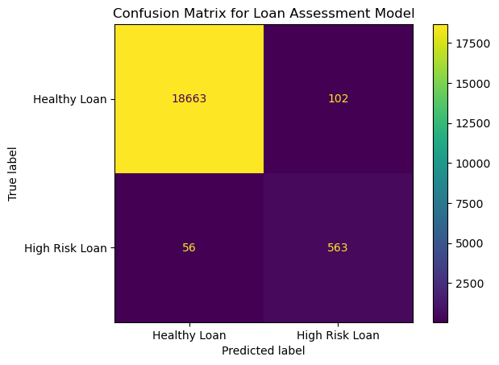

# Module 20 ML Supervised

## Overview of the Analysis

The assignment was to analyse a lending dataset and then be able to predict if a loan was healthy or high risk.  We used a supervised Machine Learning algorithm for this analysis. The dataset consisted of the following fields:
```
<class 'pandas.core.frame.DataFrame'>
RangeIndex: 77536 entries, 0 to 77535
Data columns (total 8 columns):
 #   Column            Non-Null Count  Dtype  
---  ------            --------------  -----  
 0   loan_size         77536 non-null  float64
 1   interest_rate     77536 non-null  float64
 2   borrower_income   77536 non-null  int64  
 3   debt_to_income    77536 non-null  float64
 4   num_of_accounts   77536 non-null  int64  
 5   derogatory_marks  77536 non-null  int64  
 6   total_debt        77536 non-null  int64  
 7   loan_status       77536 non-null  int64  
dtypes: float64(3), int64(5)
memory usage: 4.7 MB
```

Column 7 was the outcome of the loan (`y value`) and the other columns were our features (`x values`).  All the columns were numeric, hence we did not need to transform any data fields to use in the model.

We applied the Logistic Regression model to train and test the data. The testing was the ability of the model to predict the loan_status (`y value`). The data set was divided into training and testing as below:

```
Records in the dataset: 77536
Records in the training set: 58152
Records in the testing set: 19384
```

The model was trained using the training dataset and used to predict the outcome loan status (`y value`) using the testing dataset.

In this analysis, we will apply a discriminative supervised learning algorithm to distinguish between healthy and high-risk loans. The simplest model would be the logistic regression, which we have used in this assignment. Other algorithms, such as Support Vector Machine (SVM) and Random Forests, can be used in this scenario.

## Results

The Confusion Matrix based on the testing dataset shows the following:



The True High-Risk loan numbers (56 + 563 = 619) are much smaller than the True Health Loans (18663 + 102 = 18765), making this dataset unbalanced.

The Classification Report for the model is as follows:

```
                precision    recall  f1-score   support

  Healthy Loan       1.00      0.99      1.00     18765
High Risk Loan       0.85      0.91      0.88       619

      accuracy                           0.99     19384
     macro avg       0.92      0.95      0.94     19384
  weighted avg       0.99      0.99      0.99     19384
```

For the `Healthy Loan` prediction, the model has a very high Precision Score (1.0). This means that the model is able to predict with high certainty Actual `Healthy Loans` from all predicted 'Healthy Loans`

The Recall for `Healthy Loans` is a little less (0.99). The model was able to predict 99% of the time the actual `Healthy Loan` from all `Healthy Loans`

The high precision score for `Healthy Loans` may be because of the unbalanced dataset but the model has also got a high recall score.  The harmonic mean which is the F1 score for the `Healthy Loans` is very good at 1.0

`High Risk Loans` on the other hand has a lower Precision Score of 0.85, meaning the model is only able to predict 85% of the time the actual `High Risk Loans` from all predicted as `High Risk Loans`

The Recall Score was 0.91, which means that the model was able to predict 91% of the time `High Risk Loans` from all Actual `High Risk Loans`

The F1 Score for `High Risk Loans` was less at 0.88.

The overall Accuracy of the model was 0.99 (99%) in correctly predicting' Healthy Loans` or `High Risk Loans` from the testing dataset.


## Summary

The model is able to predict `Healthy Loans` better than `High Risk Loans`. Given that the majority of loans are `Healthy Loans`, using a Machine Learning Tool to classify between the two groups can significantly save a lot of administrative work by reducing the need to go through all applications manually. However, there exists a small risk that a loan can be approved, which is a `High-Risk Loan`. Perhaps the organisation can reduce the risk by only approving small-value loans. 

There is a 1% risk that a `Healthy Loan` can be classed as a `High Risk`. For all loans classed as `High Risk Loans, ` a manual human check would be advised to ensure suitable applicants are not disadvantaged.

Before the adoption of this Logistic Regression Model, other models should be used to classify the data, and its performance needs to be compared. 
